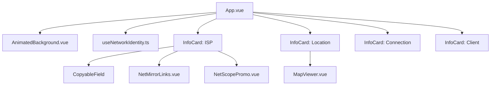

# 🌐 Edge Network Identity (Dashboard)


Painel visual avançado para análise de conectividade e observabilidade na borda. Este projeto atua como o frontend (UI) para a API serverless de identidade de rede, entregando metadados de conexão através de uma interface moderna baseada em **Glassmorphism** e **Dark Theme Cyberpunk**.

## 🚀 Funcionalidades da Interface

* **Visualização de Latência (RTT):** Exibição em tempo real do tempo de ida e volta (TCP/QUIC) processado na borda.
* **Geolocalização Interativa:** Integração com o *Leaflet* utilizando mapas "Dark Matter" da CartoDB e marcadores pulsantes em neon.
* **Integração de Ecossistema:** Links diretos e contextuais para ferramentas complementares de engenharia BGP ([NetMirror](https://github.com/luizhanauer/netmirror)) e cálculo de sub-redes ([NetScope](https://github.com/luizhanauer/netscope)).
* **Fundo SVG Animado:** Background de alta performance puramente vetorial, sem impacto no *main thread* do JavaScript.
* **UX Otimizada:** Componentes atômicos de cópia rápida (`CopyableField`) para agilizar o trabalho de sysadmins.

## 📐 Arquitetura e Padrões de Código

O desenvolvimento deste frontend segue rigorosos princípios de **Clean Architecture** e integridade de domínio:

* **Arquivos Pequenos e Focados:** Componentização granular, onde cada arquivo gerencia exclusivamente a sua responsabilidade visual ou de estado.
* **TypeScript Strict Mode:** Tipagem estrita de todos os contratos de rede e propriedades de componentes, eliminando ambiguidades em tempo de compilação.
* **Early Returns (No Else):** O código foi escrito evadiu a ramificação `else`, priorizando saídas antecipadas para manter o caminho feliz (happy path) sempre alinhado à esquerda.
* **Composição (Composition API):** Lógica de consumo de API totalmente isolada (`useNetworkIdentity`) das camadas de apresentação.

### Árvore de Componentes



## 📦 Instalação e Desenvolvimento Local

1. Clone o repositório:
   ```bash
   git clone https://github.com/seu-usuario/edge-network-identity-ui.git
   cd edge-network-identity-ui
   ```

2. Instale as dependências:
   ```bash
   npm install
   ```

3. Configure as variáveis de ambiente:
   Crie um arquivo `.env` na raiz do projeto contendo a URL da sua API Worker e dos serviços integrados:
   ```env
   VITE_API_URL=https://sua-api-worker.workers.dev/
   VITE_NETMIRROR_URL=https://luizhanauer.github.io/netmirror
   ```

4. Inicie o servidor de desenvolvimento:
   ```bash
   npm run dev
   ```

## 🛠️ Stack Tecnológica

* **Framework:** Vue 3 (Composition API)
* **Linguagem:** TypeScript 5+
* **Build Tool:** Vite 6
* **Estilização:** Tailwind CSS v4
* **Mapas:** Leaflet (OpenStreetMap / CartoDB Dark Matter)

## 🤝 Ecossistema de Redes

Este projeto faz parte de uma suíte de ferramentas de infraestrutura. Conheça as outras ferramentas:
* 🌐 **[NetScope](https://github.com/luizhanauer/netscope):** High-performance Network Intelligence Tool.
* 🖧 **[NetMirror Global](https://github.com/luizhanauer/netmirror):** API estática de prefixos IPv4/IPv6 BGP do NRO.

Contribuição
------------

Contribuições são bem-vindas! Se você encontrar algum problema ou tiver sugestões para melhorar a aplicação, sinta-se à vontade para abrir uma issue ou enviar um pull request.

Se você gostou do meu trabalho e quer me agradecer, você pode me pagar um café :)

<a href="https://www.paypal.com/donate/?hosted_button_id=SFR785YEYHC4E" target="_blank"></a>


Licença
-------

Este projeto está licenciado sob a Licença MIT. Consulte o arquivo LICENSE para obter mais informações.


---
*Construído para engenheiros de rede e entusiastas de infraestrutura de borda.*